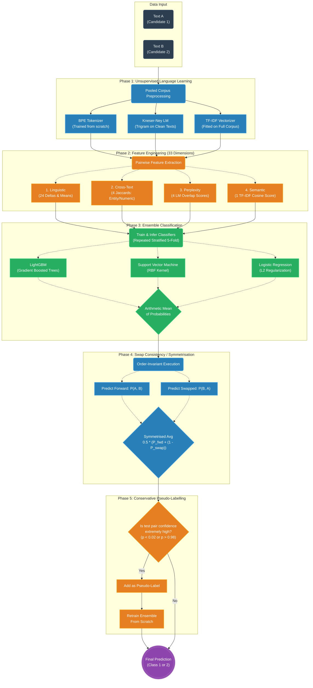

# Hallucination Detection Pipeline Architecture

This diagram visually details the end-to-end structure of your hallucination detection system. You can copy the code below or view the rendered version directly in your preferred Markdown editor that supports Mermaid diagrams (like GitHub or modern VS Code extensions).

